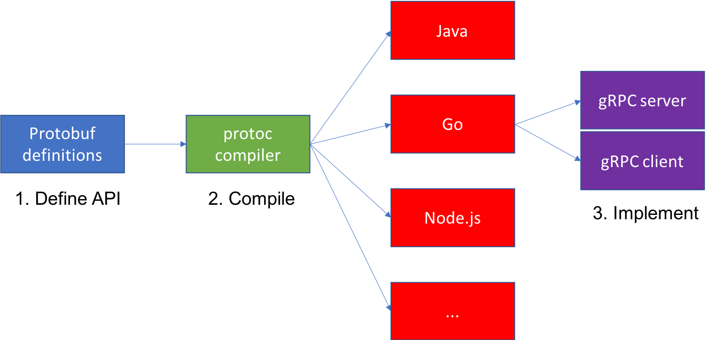

Code Presenting

---
Working With Code Blocks

### What is gRPC?
- Open remote procedure call (RPC) framework
- Enables client and server to communicate transparently
- **service definition language** to describe API using Protobuf
- efficient serialization using Protobuf
- efficient connection using HTTP/2
- connection options: unary, server-side streaming, client-side streaming, bidirectional streaming 
---

---
### Workflow

---
### Why not REST?
- textual
- http request = tcp connection
- larger headers - no compression
- unidirectional  
---
### Benefits of HTTP/2
- Clear api description using a service definition language
- Protocol buffers: efficient serialization
- multiplexing over single connection
- header compression
- server push
- HTTP/2: low latency transport  

https://imagekit.io/demo/http2-vs-http1
---
### Gimme code already!
